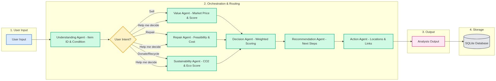

# 🧹 Smart Decluttering Assistant


An intelligent multi-agent decluttering platform that helps you decide whether to keep, repair, sell, donate, or recycle your unused items.

---

## 📌 Overview
The **Smart Decluttering Assistant** is an end-to-end multi-agent AI system designed to analyze household clutter using multimodal inputs (text descriptions and photos). Powered by the **Google Agent Development Kit (ADK)** and **Gemini 2.0 Flash Lite**, the system evaluates market price values, assesses physical repair feasibility, calculates environmental impact, and provides specific, real-world locations in Indonesia to sell, donate, repair, or recycle items.

*This project was built as a capstone submission for the **Kaggle 5-Day AI Agents Intensive Capstone**.*

---

## 🚀 Features
- **Multi-Agent AI Pipeline**: Leverages 7 specialized collaborative agents developed using the Google ADK.
- **Intent-Based Adaptive Orchestration**: Optimizes processing efficiency by dynamically running only relevant evaluation agents based on the user's intent.
- **Multimodal Inputs**: Evaluates items using combined descriptive text inputs and uploaded physical photos.
- **Real-Time Market Search**: Grounded with real-time web searches to retrieve actual second-hand pricing, donation programs, and repair shops in Indonesia.
- **Bilingual Interface**: Seamless translation toggle between Indonesian (🇮🇩 ID) and English (🇬🇧 EN) across all UI cards and results.
- **Modern Notion/Linear Style UI**: A clean, editorial design supporting light mode and dark mode color themes.
- **Inventory History**: Persistent storage of analyzed items using an SQLite backend, featuring status-colored indicators and deletion options.
- **Model Context Protocol (MCP) Integration**: Integrates real-time external tools dynamically via the stdio MCP JSON-RPC protocol, utilizing Brave Search MCP for live web scraping and Google Maps MCP for searching physical store drop-points in Indonesia.

---

## 📐 Architecture
The orchestrator routes user inputs dynamically to minimize model latency. When an intent is selected (e.g., "Want to sell"), non-relevant evaluation agents (like repair or sustainability) are skipped, routing directly to the final recommendation and action stages.

### Orchestration Flowchart



### Agent Directory

1. **understanding_agent**: Identifies the item brand, model, physical condition, and buy-date (used to accurately calculate estimated age up to 2025).
2. **repair_agent**: Evaluates physical defect issues, estimates spare part availability, and calculates repair feasibility scores.
3. **value_agent**: Checks live second-hand market listings in Indonesia (Tokopedia, OLX, Shopee) and assigns a demand/resell score.
4. **sustainability_agent**: Estimates potential carbon footprint reduction and evaluates eco-friendly disposal routes.
5. **decision_agent**: Computes weighted scores (Repair: 40%, Value: 35%, Sustainability: 25%) and boosts user-intent choices by +20 points.
6. **recommendation_agent**: Drafts tailored advice and steps to carry out the selected decision.
7. **action_agent**: Connects users to specific physical outlets, websites, contact numbers, or drop points in Indonesia.

---

## 🛠️ Tech Stack
- **Google ADK (Agent Development Kit)**: Orchestration and agent declaration.
- **Gemini 2.0 Flash Lite**: Base language and vision model for reasoning.
- **Model Context Protocol (MCP)**: Native stdio JSON-RPC Brave Search & Google Maps integrations.
- **Streamlit**: Single-column responsive user dashboard.
- **SQLite**: Structured database for inventory logging.
- **Python 3.12**: Core runtime environment.

---

## ⚙️ Getting Started

### Prerequisites
- Python 3.12 installed on your machine.
- A Gemini API Key from Google AI Studio.

### Installation

1. **Clone the repository:**
   ```bash
   git clone https://github.com/your-username/smart-decluttering-assistant.git
   cd smart-decluttering-assistant
   ```

2. **Install required packages:**
   ```bash
   pip install -r requirements.txt
   ```

3. **Set your API Key:**
   ```bash
   export GEMINI_API_KEY="your_api_key_here"
   ```

4. **Launch the dashboard:**
   ```bash
   streamlit run app.py
   ```

---

## 🔑 Environment Variables
Configure the following keys in your environment:

- `GEMINI_API_KEY` (Required): Used to authenticate with the Gemini Developer API. Get one from [Google AI Studio](https://aistudio.google.com/).
- `BRAVE_API_KEY` (Optional): Required to activate real-time web grounding via Brave Search MCP.
- `GOOGLE_MAPS_API_KEY` (Optional): Required to activate drop-point queries via Google Maps MCP.

---

## 📁 Project Structure
```text
smart-decluttering-assistant/
│
├── agents/
│   ├── understanding_agent.py   # Extract brand, condition, buy date (Multimodal)
│   ├── repair_agent.py          # Assess repair costs & parts availability
│   ├── value_agent.py           # Fetch market resale values via Google Search
│   ├── sustainability_agent.py  # Estimate carbon reductions
│   ├── decision_agent.py        # Compute final weighted decision scores
│   ├── recommendation_agent.py  # Compile user next steps
│   └── action_agent.py          # Retrieve physical location map links in Indonesia
│
├── app.py                       # Notion/Linear inspired Streamlit dashboard
├── orchestrator.py              # Orchestration & path execution logic
├── inventory_db.py              # SQLite storage management
├── requirements.txt             # Project library requirements
└── flowchart.md                 # System architecture diagram
```

---

## 🔒 Security Features
The platform implements multiple security guards to ensure data integrity and model safety:
- **Secure Key Management**: API credentials (`GEMINI_API_KEY`, `BRAVE_API_KEY`, and `GOOGLE_MAPS_API_KEY`) are managed strictly using local environment variables or standard `.env` configuration files. Keys are never hardcoded inside source files.
- **Input Sanitization & Boundary Guards**: To defend agents against Prompt Injection, the input sequence performs validation filters at both the Streamlit UI and Orchestrator entry levels. Description text inputs are trimmed, limited to a maximum length of **500 characters**, and rejected if they contain injection signatures (e.g. *"ignore previous instructions"*, *"system:"*, *"you are now"*, etc.).
- **Local SQLite Backend**: The inventory history is logged to a local SQLite database file (`declutter_inventory.db`) stored on the host system. No external database servers or services are exposed.
- **Zero Third-Party Exfiltration**: No user inputs, uploaded photos, or processed meta-data are dispatched to any external endpoints or third-party servers, other than standard API communication with the Google Gemini API.


