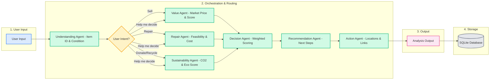

```mermaid
graph LR
    %% Styling Classes
    classDef inputStyle fill:#DBEAFE,stroke:#3b82f6,stroke-width:2px;
    classDef agentStyle fill:#D1FAE5,stroke:#10b981,stroke-width:2px;
    classDef decisionStyle fill:#FEF3C7,stroke:#f59e0b,stroke-width:2px;
    classDef outputStyle fill:#FCE7F3,stroke:#ec4899,stroke-width:2px;
    classDef storageStyle fill:#E5E7EB,stroke:#6b7280,stroke-width:2px;

    %% 1. User Input Layer
    subgraph INPUT ["1. User Input"]
        Input["User Input"]:::inputStyle
    end

    %% 2. Orchestration & Routing Layer
    subgraph ORCHESTRATION ["2. Orchestration & Routing"]
        direction TB
        UA["Understanding Agent - Item ID & Condition"]:::agentStyle
        
        Router{"User Intent?"}:::decisionStyle
        
        VA["Value Agent - Market Price & Score"]:::agentStyle
        RA["Repair Agent - Feasibility & Cost"]:::agentStyle
        SA["Sustainability Agent - CO2 & Eco Score"]:::agentStyle
        
        DA["Decision Agent - Weighted Scoring"]:::agentStyle
        RecA["Recommendation Agent - Next Steps"]:::agentStyle
        ActA["Action Agent - Locations & Links"]:::agentStyle

        UA --> Router
        
        Router -->|Sell| VA
        Router -->|Repair| RA
        Router -->|Donate/Recycle| SA
        
        Router -->|Help me decide| VA
        Router -->|Help me decide| RA
        Router -->|Help me decide| SA
        
        VA --> DA
        RA --> DA
        SA --> DA
        
        DA --> RecA
        RecA --> ActA
    end

    %% 3. Output Layer
    subgraph OUTPUT ["3. Output"]
        OutputNode["Analysis Output"]:::outputStyle
    end

    %% 4. Storage Layer
    subgraph STORAGE ["4. Storage"]
        DB[("SQLite Database")]:::storageStyle
    end

    %% Connections across layers
    Input --> UA
    ActA --> OutputNode
    OutputNode --> DB
```
